
<h1 align="center">82.学生社团活动管理系统</h1>

 获取sql文件 QQ: 386869957 QQ群: 377586148 

 [推荐站点: 从戎源码网](https://armycodes.com/) 

## 简介

> 本代码来源于网络,仅供学习参考使用!
>
> 提供1.远程部署/2.修改代码/3.设计文档指导/4.框架代码讲解等服务
> 
> 访问地址：http://localhost:8080/index.do
> 
> 管理员： admin 123456
> 
> 学生：001 123456
> 
> 社团：001 123456
> 
> 用户：user 123456
> 

## 项目介绍
基于ssm的学生社团活动管理系统：前端 jsp、jquery、ajax，后端 springmvc、spring、mybaties，角色分为管理员、学生、社团、用户；集成社团活动，新闻信息，在线留言，社团申请，审核等功能于一体的系统。

## 功能介绍

### 管理员

- 系统用户管理：管理员增删改查，密码修改
- 新闻数据管理：新闻信息的增删改查，富文本编辑
- 系统简介设置：关于我们内容信息编辑修改
- 用户注册管理：用户在前端注册后的数据记录，编辑，删除，查看详情，审核
- 留言管理：留言信息的查看，回复，删除
- 学生管理：学生信息的删改查，多条件搜索查询，审核
- 退团申请管理：申请信息的查询，编辑，删除，审核
- 入团申请管理：申请信息的查询，编辑，删除，审核
- 社团管理：社团息息的增删改查，多条件查询
- 社团活动管理：社团活动删改查，审核

### 社团

- 个人资料管理：个人资料查看和修改
- 退团申请管理：申请信息的查询，编辑，删除，审核
- 入团申请管理：申请信息的查询，编辑，删除，审核
- 社团活动管理：社团活动删改查，审核

### 学生

- 个人资料管理：个人资料查看和修改
- 退团申请管理：申请信息的查询，编辑，删除，添加退团申请
- 入团申请管理：申请信息的查询，编辑，删除，添加入团申请

### 用户

- 基本功能：登录，注册，退出，个人资料查看和修改
- 网站前台：视频中心，关于我们，学生信息，社团信息，新闻信息浏览，系统概要，在线留言

## 环境

- <b>IntelliJ IDEA 2021.3</b>

- <b>Mysql 5.7.26</b>

- <b>Tomcat 7.0.73</b>

- <b>JDK 1.8</b>

## 运行截图
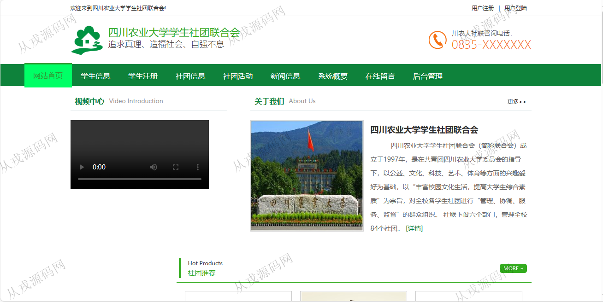

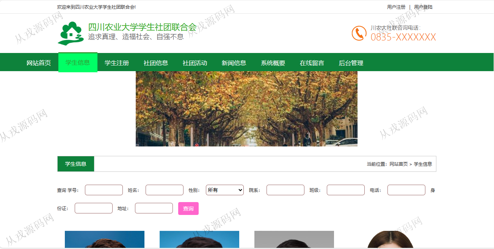

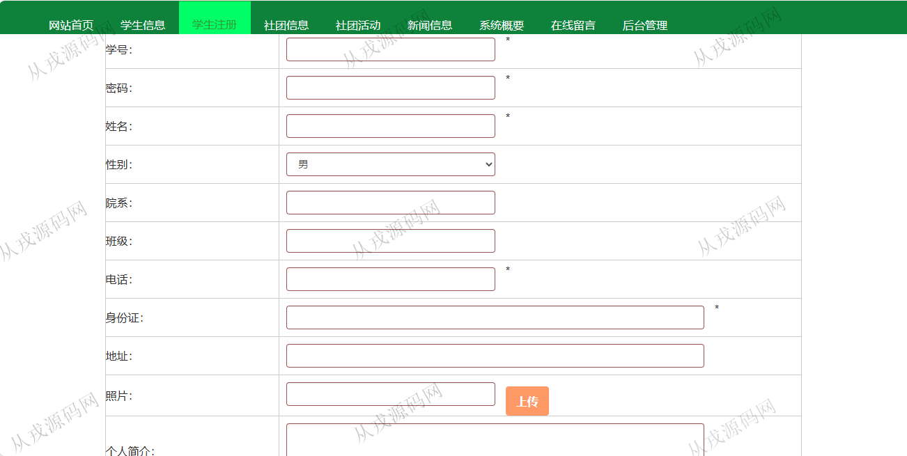

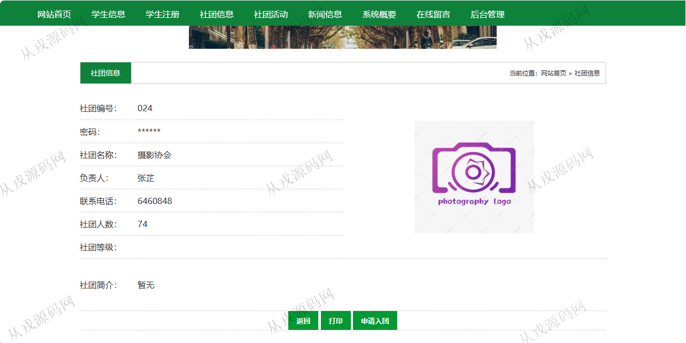

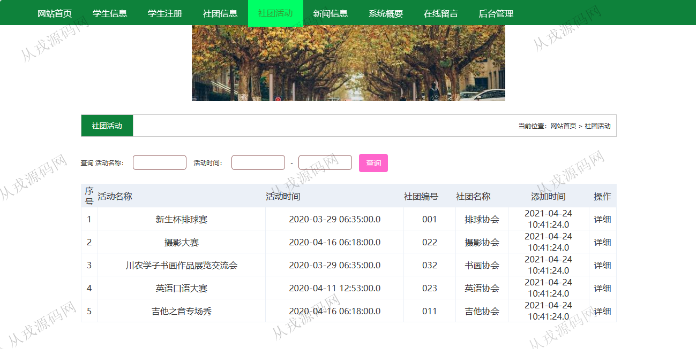

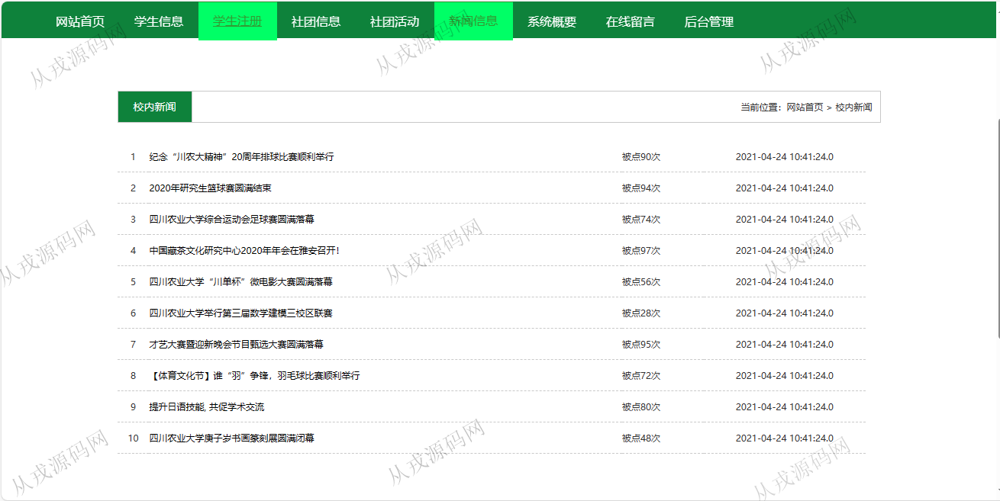

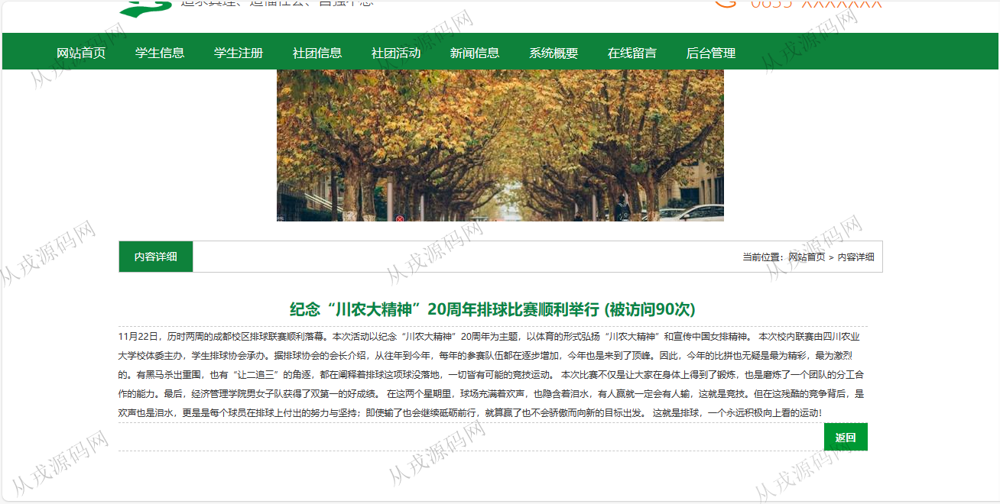

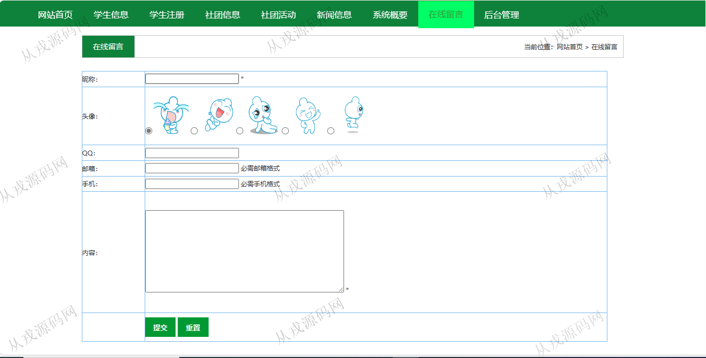

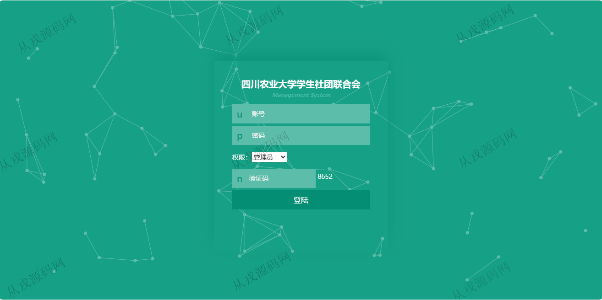

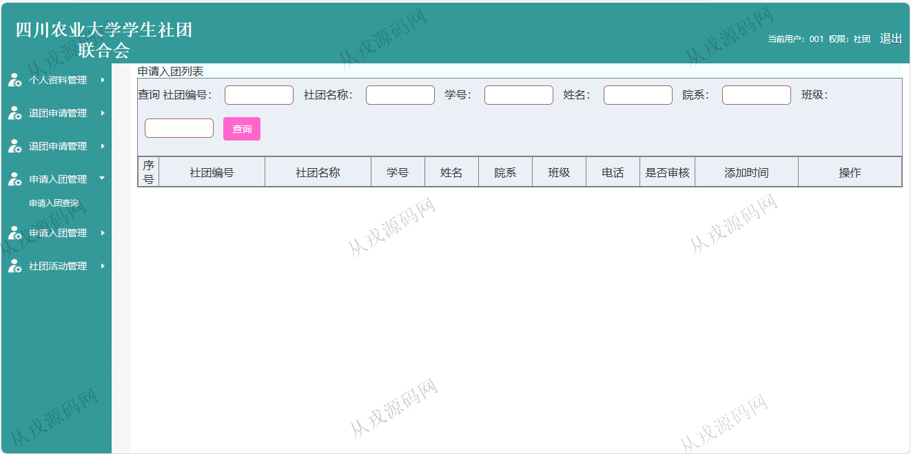

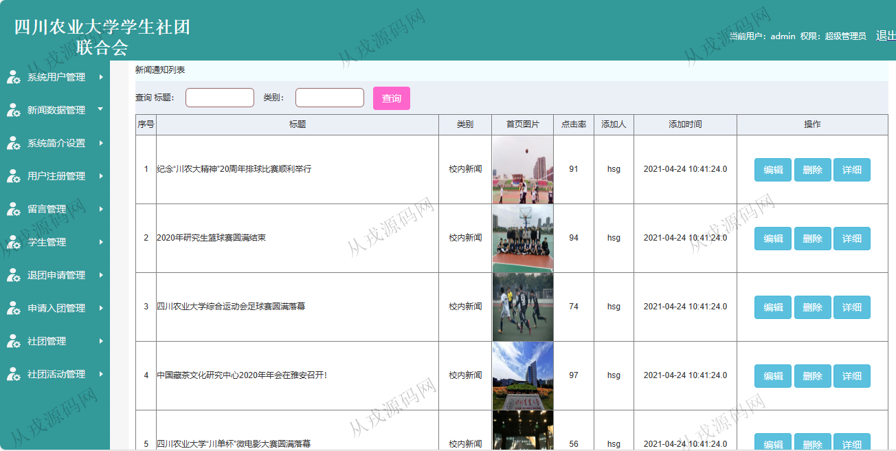

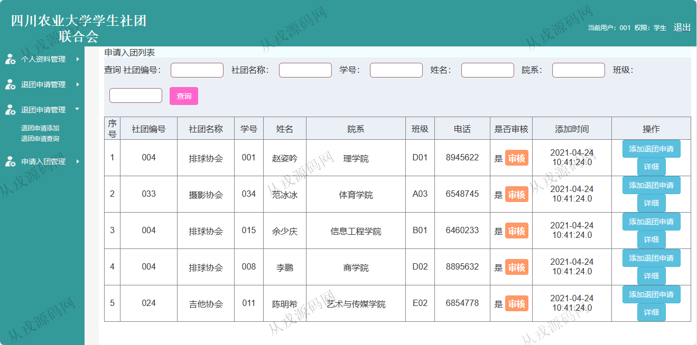